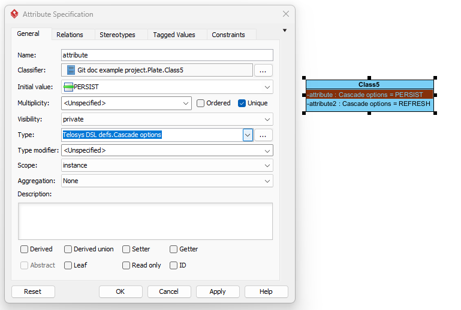
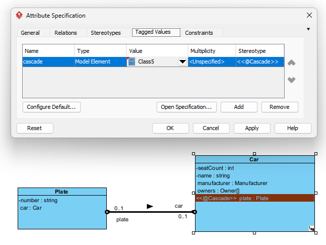
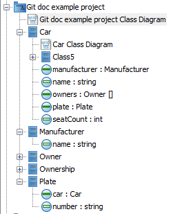
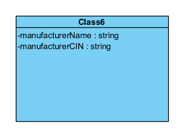
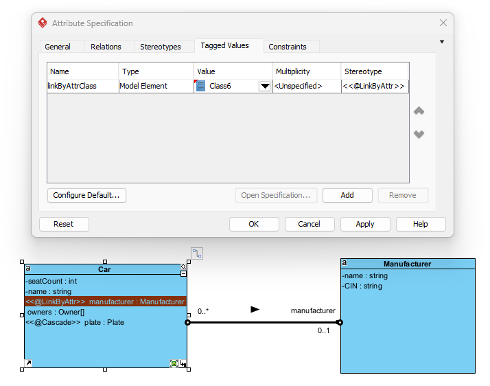
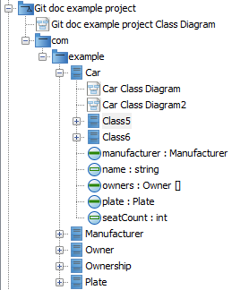
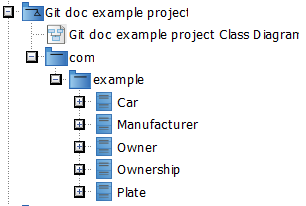

# Annotations
Below are all annotations of Telosys DSL and their representation in Graphical Telosys DSL. 
### @Abstract
Class modifier (in general class properties).

### @AggregateRoot
Class stereotype.

### @AutoIncremented
Attribute stereotype.

### @Cascade(string [, string, ...] )
Attribute stereotype with tagged value:
<ul>
 <li>cascade - Reference to a support inner class. </li>
</ul>

Uses inner support class that contains only attributes of type `Telosys DSL defs.Cascade Options`. 
The initial value property of these attributes is set to the desired option. Name of the attributes 
and class does not matter.   

*Support class*

*Tagged value*

*Class5 must be inside class Car*

### @Context(string)
Class stereotype with tagged value:
<ul>
    <li>context</li>
</ul>

### @DbCatalog(string)
Class stereotype with tagged value:
<ul>
    <li>dbCatalog</li>
</ul>

### @DbComment(string)
Class or attribute stereotype with tagged value:
<ul>
    <li>dbComment</li>
</ul>

### @DbDefaultValue(string)
Attribute stereotype with tagged value:
<ul>
    <li>dbDefaultValue</li>
</ul>

### @DbName(string)
Attribute stereotype with tagged value:
<ul>
    <li>dbName</li>
</ul>

### @DbSchema(string)
Class stereotype with tagged value:
<ul>
    <li>dbSchema</li>
</ul>

### @DbSize(string)
Attribute stereotype with tagged value:
<ul>
    <li>dbSize</li>
</ul>

### @DbTable(string)
Class stereotype with tagged value:
<ul>
    <li>dbTable</li>
</ul>

### @DbTablespace(string)
Class stereotype with tagged value:
<ul>
    <li>dbTableSpace</li>
</ul>

### @DbType(string)
Attribute stereotype with tagged value:
<ul>
    <li>dbType</li>
</ul>

### @DbView
Class stereotype.

### @DefaultValue(string)
Attribute stereotype with tagged value:
<ul>
    <li>defaultValue</li>
</ul>

### @Domain(string)
Class stereotype with tagged value:
<ul>
    <li>domain</li>
</ul>

### @Embedded
Attribute stereotype.

### @Extends(string)
Generalization.

### @FetchTypeEager
Attribute stereotype.

### @FetchTypeLazy
Attribute stereotype.

### @FK( [fkName,] referencedEntity[.attribute] )
Attribute stereotype with tagged values:
<ul>
    <li>fkName</li>
    <li>referenced - Reference to a class or attribute.</li>
</ul>

### @Future
Constraint or attribute stereotype.

### @GeneratedValue(string [, string, ...])
Represented by 4 stereotypes:
<ul>
    <li>@GeneratedValueAUTO</li>
    <li>@GeneratedValueIDENTITY</li>
    <li>@GeneratedValueSEQUENCE - this stereotype has tagged values:</li>
    <ul>
        <li>generatorName</li>
        <li>sequenceName</li>
        <li>allocatedSize</li>
    </ul>
    <li>@GeneratedValueTABLE - this stereotype has tagged values:</li>
    <ul>
        <li>generatorName</li>
        <li>tableName</li>
        <li>pkColumnName</li>
        <li>pkColumnValue</li>
        <li>valueColumnName</li>
        <li>allocatedSize</li>
    </ul>
</ul>

### @Id
Attribute modifier (in general attribute properties).

### @InitialValue(string)
Attribute property initial value.

### @InMemoryRepository
Constraint or class stereotype.

### @InputType(string)
Attribute stereotype with tagged value:
<ul>
    <li>inputType</li>
</ul>

### @Insertable(boolean)
Attribute stereotype with tagged value:
<ul>
    <li>insertable</li>
</ul>

### @JoinEntity
Generated automatically on association class of Many-To-Many relationship.

### @Label(string)
Attribute stereotype.

### @LinkByAttr(string [, string, ...])
Attribute stereotype with tagged value:
<ul>
 <li>linkByAttrClass - Reference to a support inner class. </li>
</ul>

Uses inner support class that contains all attributes that this annotation uses. The support class attributes are 
added to the entity in compilation (the final entity is a merge of class and the support class).
Name of the class does not matter.

*Support class*

*Tagged value*

*Class6 must be inside class Car*

### @LinkByFK(string)
Attribute stereotype with tagged value:
<ul>
    <li>fkName</li>
</ul>

### @LinkByJoinEntity(string)
Generated automatically for Many-To-Many relationship with association class.

### @LongText
Attribute stereotype.

### @ManyToMany
Multiplicity on both sides of a relationship set to 0..*.

### @MappedBy(attributeName)
Generated automatically on inverse side of bidirectional relationship. 

### @Max(decimal)
Attribute stereotype with tagged value:
<ul>
    <li>max</li>
</ul>

### @MaxLen(int)
Attribute stereotype with tagged value:
<ul>
    <li>maxLen</li>
</ul>

### @Min(decimal)
Attribute stereotype with tagged value:
<ul>
    <li>min</li>
</ul>

### @MinLen(int)
Attribute stereotype with tagged value:
<ul>
    <li>minLen</li>
</ul>

### @NotBlank
Constraint or attribute stereotype.

### @NotEmpty
Constraint or attribute stereotype.

### @NotNull
Constraint or attribute stereotype.

### @ObjectType
Attribute stereotype.

### @OneToOne
Multiplicity on both sides of a relationship set to 0..1.

### @Optional
Attribute stereotype.

### @OrphanRemoval
Attribute stereotype.

### @Package(string)
UML Package element. The name in annotation is created by concatenating names of the individual packages 
(the default separator is ".").

*With default separator creates annotation @Package(com.example).*

### @Past
Constraint or attribute stereotype.

### @Pattern(string)
Attribute stereotype with tagged value:
<ul>
    <li>pattern</li>
</ul>

### @PrimitiveType
Attribute stereotype.

### @ReadOnly
Constraint or attribute stereotype.

### @Size(size)
Attribute stereotype with tagged value:
<ul>
    <li>precision - Integer representing the precision part</li>
    <li>scale - Integer representing the scale part</li>
</ul>

### @SizeMax(int)
Attribute stereotype with tagged value:
<ul>
    <li>sizeMax</li>
</ul>

### @SizeMin(int)
Attribute stereotype with tagged value:
<ul>
    <li>sizeMin</li>
</ul>

### @Transient
Attribute stereotype.

### @Unique
Attribute stereotype.

### @UnsignedType
Attribute stereotype.

### @Updatable(boolean)
Attribute stereotype with tagged value:
<ul>
    <li>updatable</li>
</ul>