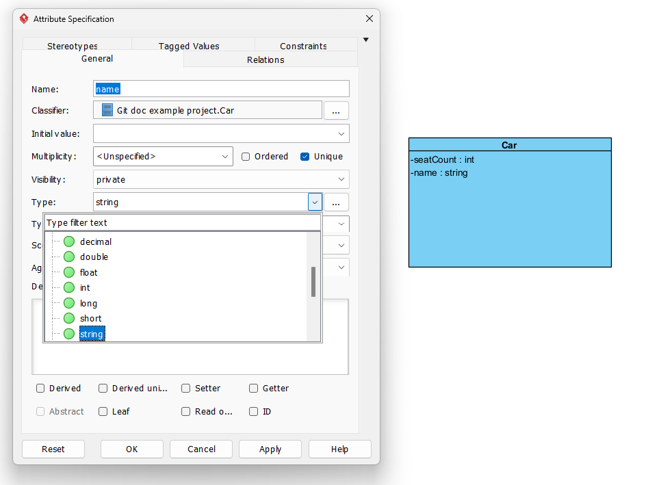
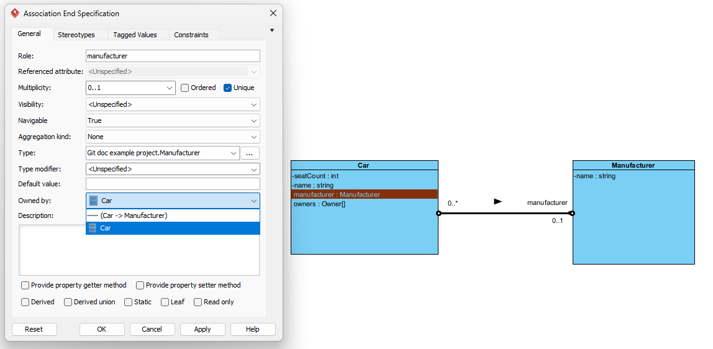
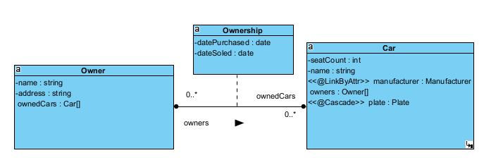
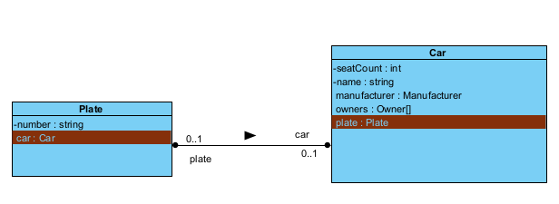

# Graphical Telosys DSL
This representation is based on UML Class Diagram. The following sections describe how each Telosys DSL element is modeled.

### Model and Entity
Telosys model is represented by UML model in the root of Visual Paradigm project. UML model can contain packages 
(for @Package) and classes (represents entities). Each package can contain packages and classes.

TODO add example picture 

### Attribute
Telosys attribute is represented by class attribute. Attribute type has to be one of the simple types 
specified in Telosys DSL language.

### Link
Links are the most complicated part of Graphical Telosys DSL. The aim is to make relations between 
objects clearer and more graphical. For this reason Telosys link is represented with association, 
association class and representative attribute.

The association serves as a base for the relationship. Representative attribute is created by assigning ownership of
association end to class instead of association. Visual paradigm automatically generates representative attribute in
opposing class.

*One representative attribute. One-To-Many / Many-To-One*

*Both representative attributes. Many-To-Many*

Multiplicity together with type modifier (only type modifier used is '[]') describe whether link references a 
single entity or a collection. Association class is used to specify join entity (if the association is many-to-many). 

*One-To-One*

There are multiple ways of connecting representative attribute and FK attributes in Telosys. (TODO use better sentence)
<ul>
    <li>Inference - Not supported.</li>
    <li>@LinkByAttr - Stereotype.</li>
    <li>@LinkByFK - Stereotype.</li>
    <li>@LinkByJoinEntity - Automatically generated.</li>
</ul>
Additionally in One-To-One and One-To-Many, these FK attributes can be added to association class of relationship.
Plugin then automatically creates @FK and @LinkByFK annotations and adds these attributes to one of the 
two entities depending on direction. Direction is used to describe owning and inverse side of the relationship 
(owning -> inverse).

### Annotation 
Most of the annotations are represented as stereotypes, some also as constraints and other as their UML counterparts.
The list of all annotations and their representations can be found here (TODO link to new file).

### Tag
User has to define a stereotype that begins with '#'. Parameter is added as a tagged value to this stereotype 
(value type has to be 'Text').